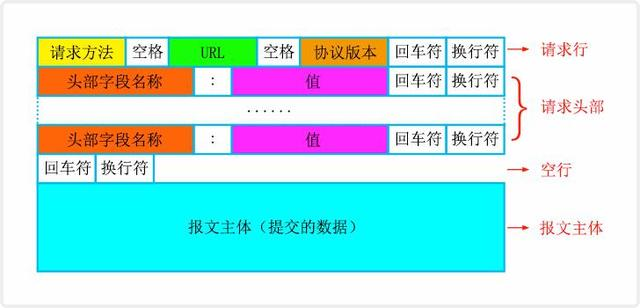

## 从一次客户端崩溃问题谈http协议格式

### 现象

因为在对服务重构，要对重构后的服务进行测试验证，因此测试服同一组接口部署了一新一旧两套http服务。与此同时，客户端sdk也从传统的java sdk升级到了嵌入lua脚本的sdk。在客户端sdk对一个接口进行多次请求时，偶尔会出现崩溃的情况但不是必现，联想到测试服部署了两套http服务，可能与此有关。

最开始猜测原因是新旧服务的header不同，因为旧服务在response中加了允许跨域的headers，但这些headers一直都没用到，所以在新服务中删除了，但通过测试，发现新服务添加了跨域头之后仍然崩溃。随后通过charles抓包抓到了两个httpResponse的纯文本格式，

**原服务返回**

```
HTTP/1.1 200 OK
Content-Type: text/plain;charset=UTF-8
Content-Length: 30
Connection: keep-alive

{"code":1,"message":"SUCCESS"}
```

**新服务返回**

```
HTTP/1.1 200 
Content-Type: text/plain;charset=UTF-8
Content-Length: 43
Date: Wed, 22 Jul 2020 12:17:21 GMT
Connection: keep-alive

{"code":1,"message":"SUCCESS"}
```

相比于旧服务，新服务的返回缺少了状态码说明“ok”，并增加了Date字段。经客户端同事排查，sdk在收到http响应时，会直接解析并引用状态码说明，导致出现了npe。

### 原因

同样是http/1.1版本的服务，返回的http协议格式不同还是比较少见的。原http服务使用的是spring-webFlux框架，该框架使用netty作为http服务器；而新服务使用的是传统的spring-boot，用内嵌的tomcat作为http服务器。原来tomcat开发者认为http状态码说明(reasonPhrase)没什么用，为了减少http协议包的大小(这才几字节，也太省了！)，在8.5及之后的版本中省去了reasonPhrase字段，可以通过sendReasonPhrase选项设置，强制tomcat返回状态码说明文字。

[tomcat8.5变更](https://tomcat.apache.org/migration-85.html#HTTP_connector_changes)

当然，tomcat官方并不会无视http协议擅自进行变更，实际上，在Http协议官方说明中([RFC 2616 Section 6.1](https://tools.ietf.org/html/rfc2616#section-6.1))，有这样一段话：

>The reason phrases listed here are only recommendations -- they MAY be replaced by local equivalents without affecting the protocol.

即reason phrase不应该影响协议的解析，即时它不存在。

在最新版的http协议文档([RFC 7230 Section 3.1.2](https://tools.ietf.org/html/rfc7230#section-3.1.2))中，更加清晰的表述了reason phrase的作用：

>The reason-phrase element exists for the sole purpose of providing a textual description associated with the numeric status code, mostly out of deference to earlier Internet application protocols that were more frequently used with interactive text clients. A client SHOULD ignore the reason-phrase content.

即reasonPhrase存在的唯一作用是为status code提供文字说明，客户端应该忽略该字段。所以tomcat不传reasonPhrase也并没有问题。如果开发者想强制开启，可以在tomcat配置文件中配置sendReasonPhrase；如果开发者使用的是spring-boot且内嵌的tomcat是8.5版本，可以通过修改内嵌tomcat的配置返回phrase。(作者用的是spring-boot 2.1，内嵌的tomcat 9.0版本，实测添加sendReasonPhrase配置后也没有生效)。

### 标准http/1.1协议格式

问题原因与http标准协议格式有关，那么http协议作为文本协议，标准格式是什么呢？

**请求标准格式**



**示例请求：**

```
POST /api/user HTTP/1.1
User-Agent: PostmanRuntime/7.24.1
Accept: */*
Cache-Control: no-cache
Host: 10.54.148.23:9325
Accept-Encoding: gzip, deflate, br
Content-Type: application/x-www-form-urlencoded
Content-Length: 301
Connection: keep-alive

user_id=1234&user_name=http
```

**响应标准格式**


**示例响应：**

```
HTTP/1.1 200 OK
Content-Type: text/plain;charset=UTF-8
Content-Length: 30
Connection: keep-alive

{"code":1,"message":"SUCCESS"}
```

method及header详情，可参考[http/1.1官方文档说明](https://tools.ietf.org/html/rfc7231)
