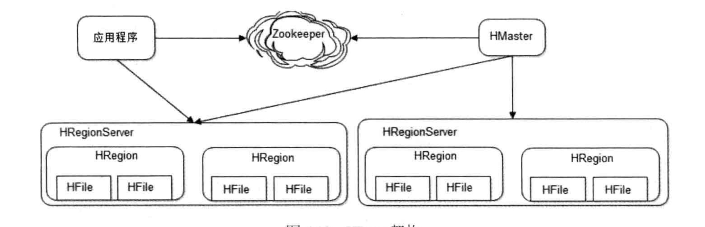

## 大型网站的可伸缩架构

所谓可伸缩架构，指的是系统能通过增加服务器的手段线性的增加整个系统的处理能力。如果网站可伸缩，就可以通过不断向集群中添加新机器，从一个只服务几十人的小网站发展成服务几十亿人的大型网站。当然，网站本身的可伸缩架构也在业务的发展过程中不断演进完善。

### 可伸缩架构的常用手段

可伸缩设计一般有两种手段:

* 对不同功能进行拆分部署管理：可以分为横向拆分和纵向拆分
	*  纵向拆分：统一功能的不同流程进行拆分，例如将应用从上到下拆分为【具体产品模块】【可复用业务】【基础服务】【数据存储】
	*  横向拆分：对同一层的不同业务进行拆分。例如电商业务通常可以拆分为【商品管理】【用户管理】【店铺管理】等
* 对同一功能进行集群部署
	* 集群的伸缩性可分为应用服务器的伸缩设计和数据服务器的伸缩设计，数据服务器的伸缩设计又可以分为缓存服务器的伸缩性设计和存储服务器的伸缩性设计。

### 应用服务器的可伸缩

用户需要通过负载均衡服务器来访问应用集群，负载均衡服务器保证新添加的服务节点能够被用户访问，而已经下线的节点不再收到访问请求。

#### 负载均衡手段

**http重定向负载均衡**

客户端先访问负载均衡服务器，负载均衡服务器返回code 302将访问重定向到实际的应用服务器。这种方案的缺点比较明显，客户端需要访问两次才能返回响应，此外，负载均衡服务器本身也可能成为瓶颈，因此使用的不多。

**dns解析负载均衡**

由DNS服务器担任负载均衡服务器的角色。优点是不用应用服务器本身去做负载均衡了，而且dns可以根据用户的地理位置将请求落在离用户较近的服务器上。但dns本身有缓存，如果服务节点下线了，但缓存中还有，可能导致访问失败。

实际上，大型网站一般部分使用dns做负载均衡的功能，将dns的解析地址指向不同的访问集群，集群本身的dns服务器再分配具体的服务节点。

**反向代理负载均衡**

利用反向代理服务器再http协议层将请求转发到应用服务器，例如常用的nginx服务器。优点是部署简单，缺点是反向代理服务器是请求的中转站，可能成为整个系统的性能瓶颈。

**Ip负载均衡**

在网络层通过修改请求目标地址进行负载均衡。用户请求到达负载均衡服务器后，负载均衡器修改网络包目的地为真实的应用服务器，应用服务器处理完请求后返回给负载均衡器，负载均衡服务器修改源地址为自身地址后再返回给用户。

相比于反向代理服务器，ip负载均衡服务器直接在网络层处理数据包，较应用层处理有更好的性能。但也受限于均衡器网卡的带宽，对于提供下载服务或视频服务的应用，难以满足需求。

**数据链路层负载均衡**

链路层负载均衡器主要通过修改网络包的目的mac地址来达到负载均衡的目的。使用该方法时，需要将负载均衡服务器和应用服务器设置同样的虚拟ip，当用户请求到达负载均衡服务器时，负载均衡服务器修改网络包的mac地址为应用服务器的mac地址，应用服务器处理完成后将响应数据直接返回给用户。

该方法响应时不再经过负载均衡服务器，因此性能不会受限于负载均衡服务器，这种方式也是目前应用最多的负载均衡方式。linux平台上常用的链路层负载均衡器是LVS(Linux Virtual Server)。

#### 负载均衡算法

**轮询**

将请求依次分发到每台服务器上，如果服务器性能配置各不相同，也可以使用加权轮询的方式。

**随机**

将请求随机分配到某台服务器，如果服务器性能配置不同，也可以使用加权随机的方式。

**最少链接**

记录每台服务器的连接数，将请求分配到连接数最少的服务器上，这样可以最大化利用服务器资源。

**源地址散列**

对请求的ip进行hash，根据hash值分配服务器。这样可以做到同一ip的请求总是到指定服务器，可以将记录请求的上下文信息，实现会话粘滞。

### 缓存服务器的可伸缩

不同于应用服务器的负载均衡，缓存服务器的不同节点存放了不同数据，负载均衡器需要先定位到要访问数据存储的节点再进行路由，这极大的制约了缓存服务器的可伸缩性。

当新加入缓存服务器时，原先缓存的数据还能尽可能被访问到，是缓存服务器可伸缩性设计的主要目的。传统的通过余数进行路由的算法，在添加/减少节点时，会导致大量缓存访问miss，可以使用一致性hash算法解决余数hash带来的问题。

#### 一致性hash算法

**一致性hash**

通过一致性hash环来实现key到节点的映射。首先设置一个0～2^32长度的环，然后计算各个节点的hash值，根据hash值将各个节点放置到环上的指定位置。当添加新的节点时，只有环上的一小部分数据需要转移到新节点，最小化了添加节点对节点路由的影响。

但这种方法还有一个小问题，当添加节点时，新节点只分担了一个旧节点的访问压力，此时，其他节点的访问压力仍然很大。

**添加虚拟节点的一致性hash**

解决一致性hash带来的负载不均衡问题，可以通过添加虚拟层解决。将每台物理服务器分为一组虚拟服务器，各虚拟服务器分别计算hash值，将虚拟服务器添加到hash环中。最终的结果是，当添加节点时，实际上是将一组虚拟节点较为均匀的添加到了hash环中，分摊了其他节点的访问压力。一般来讲，一台物理服务器可以分拆为150个虚拟节点，当然节点数量应该根据使用场景再具体计算，节点太少，会影响均衡性，但节点太多，可能会影响性能。

> 注：分层是计算机系统设计中的重要方法。计算机硬件/操作系统/软件、tcp/ip协议等经典结构，都使用了分层的方法。在分层结构中，每一层都可以看作下一层的虚拟层。

### 存储服务器的可伸缩

数据存储服务器必须保证数据的可靠存储，任何情况下都必须保证数据的可用性和正确性，因此不能简单使用缓存的伸缩性方案。

#### 通过中间件(cobar)做数据库集群的伸缩

cobar的伸缩性可以分为cobar服务器集群的可伸缩和mysql集群的可伸缩，cobar本身是无状态服务，可以使用传统的负载均衡机制实现可伸缩；但mysql中存储数据，要想保证扩容后的数据一致性，必须进行数据迁移。cobar利用mysql的数据同步功能进行数据迁移，cobar在mysql实例中创建很多schema，当集群扩容时，从每个服务器中迁移部分schema到新机器中，由于迁移以schema为单位，所以迁移过程中可以使用mysql的同步机制。

在整个访问过程中，cobar负责对sql语句进行解析，将sql查询分发至不同的mysql实例，然后将结果合并发回给应用服务器。通过cobar连接数据库，可以一定程度上优化mysql实例的连接管理。

因为数据会散落在各个mysql实例中，因此无法在cobar中进行跨表join、事务等操作。可以分解数据访问逻辑解决join问题，使用事务补偿机制解决跨库事务问题。

#### HBase可伸缩设计

HBase的伸缩性主要通过可分裂的HRegion及可伸缩的分布式文件系统HDFS实现，

HBase架构图：

如果所示，HBase中，数据以HRegion为单位进行组织，HRegionServer是一个物理实例，每个HRegionServer可以存储多个HRegion，每个HRegion存储一段[key1, key2)的区间数据，当一个HRegion写入的数据过多达到阈值时，HRegion会分裂成两个，HRegion会在集群中迁移，以保证HRegionServer的负载均衡。

应用程序在访问HBase数据时，首先通过zookeeper拿到主HMaster的地址，然后输入Key通过HMaster查询出key所在的HRegionServer，然后从HRegion中读取数据。

### 总结

网站的伸缩性架构跟可用性、正确性、性能耦合在一起，改善伸缩性必然会影响一些其他的特性。架构师必须对网站的商业目标、历史演化、技术路线了然于胸，甚至要考虑技术团队的知识储备和结构，管理层的战略愿景和使命，才能对网站伸缩性架构作出合适的选择。

伸缩性架构的设计总是在业务前面，当业务需要承担更大的访问量和更多的数据之前，网站已经做好了充足的准备。

>1：高手之所以成为高手，是因为他们遇到了常人难以解决的问题，并解决了

>2：遇到问题，分析问题，最后总能解决问题，不能期待救世主降临解决问题。
